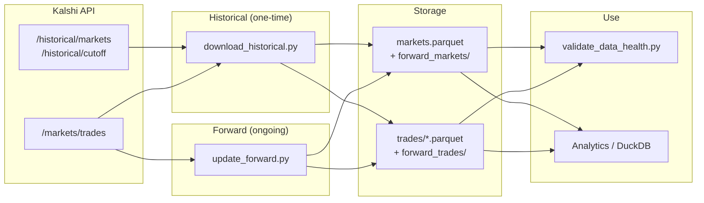
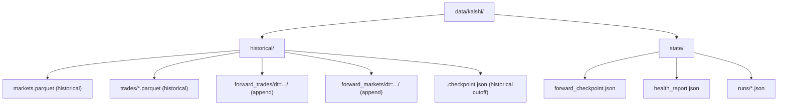
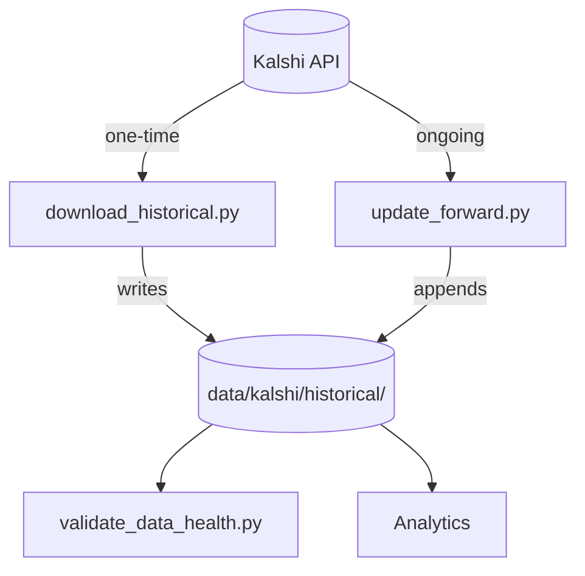

# Kalshi Data Pipeline — Full Summary

One document that explains what we built, how it works, what went wrong, and how we fixed it. Plain English, with examples and visuals.

**Quick links:** [Timeline](#1-timeline) · [Two kinds of data](#2-what-we-have-two-kinds-of-data) · [Pipeline flow](#3-how-the-pipeline-works-visual) · [Where we store](#4-where-we-store-everything-folder-layout) · [Why Parquet](#5-why-parquet-files) · [Avoiding mess-ups](#6-how-we-avoid-messing-up-historical-vs-forward) · [Problems & fixes](#7-problems-we-hit-and-how-we-solved-them) · [Health checks](#8-how-we-check-for-a-healthy-dataset) · [Duplication](#9-duplication-how-we-manage-it) · [Commands](#11-simple-commands-examples) · [Scripts reference](#12-scripts-reference) · [Data storage & analytics](#15-data-storage-and-analytics)

---

## 1. Timeline

- **Historical pull:** It took **two days** to download all historical Kalshi data (markets + trades per market). I finished on **Friday**.
- **Since then:** I worked only on **forward** (live / up-to-date) data: how to keep pulling new trades and markets without re-downloading everything, where to store them, and how to keep the dataset healthy.

---

## 2. What We Have: Two Kinds of Data

| Kind | What it is | How we get it |
|------|------------|----------------|
| **Historical** | A one-time snapshot of all markets and all past trades up to a fixed “cutoff” date the API provides. | Run `download_historical.py` once (or when you want to refresh). It can take a long time (e.g. two days). |
| **Forward** | New trades and markets *after* that cutoff — the “live” or “up-to-date” part. | Run `update_forward.py` on a schedule (e.g. daily or hourly). It only fetches what’s new since the last run. |

We **never overwrite** historical with new data. We **only append** new forward data. So we always know: “this file is the old snapshot” vs “this folder is the new stuff.”

---

## 3. How the Pipeline Works (Visual)

**Flow (Mermaid — view on GitHub or any Mermaid-enabled viewer):**



**Same flow (text diagram):**

```
┌─────────────────────────────────────────────────────────────────────────────┐
│                        KALSHI API (trade-api/v2)                             │
├─────────────────────────────────────────────────────────────────────────────┤
│  /historical/markets     →  all markets up to cutoff                         │
│  /historical/cutoff     →  "up to when" is historical (e.g. trades_created_ts) │
│  /markets/trades        →  trades (by time window or by ticker)              │
└─────────────────────────────────────────────────────────────────────────────┘
                    │                                    │
                    │ ONE-TIME (e.g. 2 days)             │ ONGOING (minutes)
                    ▼                                    ▼
┌──────────────────────────────┐    ┌──────────────────────────────────────────┐
│  download_historical.py     │    │  update_forward.py                       │
│  • Fetch all markets        │    │  • Read checkpoint (last time we stopped) │
│  • For each market, fetch   │    │  • Fetch trades in (checkpoint, now]     │
│    all its trades           │    │  • Fetch markets in same time window    │
│  • Write markets.parquet   │    │  • Dedupe vs existing data               │
│  • Write trades/*.parquet  │    │  • Append new Parquet files               │
│  • Save cutoff in          │    │  • Update checkpoint                      │
│    .checkpoint.json         │    │  • Optional: --historical-only (use API   │
└──────────────────────────────┘    │    cutoff as end time, not “now”)        │
                    │               └──────────────────────────────────────────┘
                    │                                    │
                    ▼                                    ▼
┌─────────────────────────────────────────────────────────────────────────────┐
│  STORAGE (all under data/kalshi/historical/)                                │
│  • historical:  markets.parquet,  trades/*.parquet                          │
│  • forward:     forward_markets/*/*.parquet,  forward_trades/*/*.parquet    │
└─────────────────────────────────────────────────────────────────────────────┘
                    │
                    ▼
┌─────────────────────────────────────────────────────────────────────────────┐
│  HEALTH & USE                                                               │
│  • validate_data_health.py  →  check schema, duplicates, gaps, orphans     │
│  • Analytics / DuckDB       →  query historical + forward as one dataset   │
└─────────────────────────────────────────────────────────────────────────────┘
```

**In one sentence:** Historical is “everything up to the API’s cutoff,” forward is “everything after that,” and we store both in the same place and treat them as one dataset for querying and health checks.

---

## 4. Where We Store Everything (Folder Layout)

**Tree (Mermaid):**



**Same layout (text):**

Everything lives under **one root** so we don’t mix up locations:

```
data/kalshi/
├── historical/                    ← ONE PLACE for “all Kalshi data”
│   ├── markets.parquet            ← Historical: one-time snapshot of all markets
│   ├── trades/                    ← Historical: one batch file per chunk
│   │   └── batch_*.parquet
│   ├── .checkpoint.json           ← When historical download stopped (cutoff)
│   ├── forward_trades/            ← Forward: new trades, append-only
│   │   └── dt=YYYY-MM-DD/
│   │       └── trades_<run_id>.parquet
│   └── forward_markets/           ← Forward: new markets, append-only
│       └── dt=YYYY-MM-DD/   (or dt=canonical after dedupe)
│           └── markets_<run_id>.parquet
└── state/                         ← Pipeline state (not the data itself)
    ├── forward_checkpoint.json    ← “Last time we ran forward ingestion”
    ├── forward_ingestion.lock      ← Prevents two runs at once
    ├── health_report.json         ← Output of health script
    └── runs/                      ← One JSON per forward run (for audit)
```

**Why “historical” and “forward” under the same folder?** So when we run analytics or health checks, we point at **one tree** and say “all trades” = historical trades + forward trades, “all markets” = historical markets + forward markets. We never have to remember two different roots.

---

## 5. Why Parquet Files?

- **Columnar format:** Good for analytics (e.g. “sum of volume for ticker X”). We only read the columns we need.
- **Compressed:** Saves space compared to CSV/JSON.
- **Standard:** DuckDB, pandas, and most data tools read Parquet natively.
- **Append-friendly:** We add new files (e.g. `forward_trades/dt=2025-03-15/trades_xyz.parquet`) without rewriting old ones. Historical stays untouched.

**Example:** To get “all trades” in DuckDB we do something like:  
`SELECT * FROM 'data/kalshi/historical/trades/*.parquet' UNION ALL SELECT * FROM 'data/kalshi/historical/forward_trades/*/*.parquet'`.  
Same idea for markets.

---

## 6. How We Avoid Messing Up Historical vs Forward

| Rule | What we do |
|------|------------|
| **Never overwrite historical** | `download_historical.py` writes to `historical/markets.parquet` and `historical/trades/`. Forward scripts **never** write there. |
| **Only append forward** | `update_forward.py` only creates **new** files under `forward_trades/` and `forward_markets/` (e.g. one file per run date). It never deletes or overwrites old forward files. |
| **Checkpoint for forward** | We keep `state/forward_checkpoint.json` with the “last timestamp we ingested.” The next run only asks the API for data **after** that time. So we don’t re-fetch the same trades. |
| **Dedupe at write time** | Before writing a new forward file, we dedupe: if a trade_id (or market key) already exists in historical or in earlier forward files, we skip it. So even if the API sends the same row twice, we only store it once. |
| **No overlap by trade_id** | We check that no `trade_id` appears in **both** historical and forward. That way “historical” and “forward” are cleanly split by the API’s cutoff. |

So: **historical** = one-time snapshot; **forward** = append-only deltas; **same folder tree** so one query can use both.

---

## 7. Problems We Hit and How We Solved Them

**Overview:**

| Problem | Cause | Solution |
|--------|--------|----------|
| Most trades had `count` = 0 | API sends size in `count_fp`, not `count` | Use `count_fp` as source of truth; fill `count` when 0 |
| Orphan tickers (trades without markets) | Trade/market time windows didn't always overlap | 7-day market lookback + one-time fetch via `GET /markets/{ticker}` |
| Duplicate market keys | Same market in multiple forward/legacy files | Dedupe at fetch and write; one-time dedupe script + archive legacy |
| Gap between last historical and first forward | No forward run for that time window | Backfill with `--end-ts` and checkpoint set to gap start |
| Health check "API cutoff" failed (403) | Network/proxy blocking API | Treat as "skipped"; clear message, no data impact |

---

### 7.1 Most trades had “count” = 0

- **What we saw:** In the data, almost all trades had `count` (number of contracts) equal to 0, even though we knew sizes existed.
- **Cause:** The API often sends the size in a different field, `count_fp` (a string like `"10.0"`), and leaves `count` as 0.
- **What we did:** We use `count_fp` as the source of truth. When we write a row, we set `count` from `count_fp` when `count` is 0. So in the stored Parquet, `count` is filled for analytics. We still store `count_fp` as the API sent it.
- **Where:** `update_forward.py` and `download_historical.py` both use a small helper that does: “if API `count` > 0 use it, else parse `count_fp` and use that for `count`.”

### 7.2 Trades referencing “orphan” tickers (no market row)

- **What we saw:** Some trades had a `ticker` that didn’t appear in our markets table (e.g. 2,552 such tickers).
- **Cause:** We fetch trades by time window and markets by a different time window. A trade can be in our window while its market’s `close_time` is just outside the market window, so we never pulled that market.
- **What we did:**  
  - **Prevention:** We widened the market window backwards by 7 days (`MARKET_LOOKBACK_DAYS = 7`) so we pull more markets that “belong” to the trade window.  
  - **One-time fix:** We listed all orphan tickers, called the API’s `GET /markets/{ticker}` for each, and wrote those markets into forward_markets (`fix_orphan_tickers.py`). After that, the health check passed “all trade tickers exist in markets.”

### 7.3 Duplicate market keys (same ticker + close_time more than once)

- **What we saw:** The same market (same `ticker` and `close_time`) appeared multiple times in the combined markets set (e.g. 39 then 9,111 when we also had legacy data).
- **Cause:** (1) Forward runs could write the same market in different files; (2) We had an old “legacy” folder of forward data that overlapped with the new forward folder.
- **What we did:**  
  - **Prevention:** In `update_forward.py` we dedupe within each API run and again before writing (so we never write a duplicate key in new runs).  
  - **One-time fix:** We ran a script that reads all forward (and legacy) market files, keeps one row per `(ticker, close_time)`, and replaces the forward_markets folder with that single set. We also archived the legacy folder so the validator doesn’t see it anymore (`fix_forward_markets_dedupe.py --exclude-historical`).

### 7.4 Gap between “last historical” and “first forward” trade time

- **What we saw:** The last historical trade was e.g. Friday 23:00 and the first forward trade was Sunday 00:00 — about 25 hours with no trades in our dataset.
- **Cause:** No forward run had been executed for that window (e.g. pipeline not running on Saturday).
- **What we did:** We added an `--end-ts` option to `update_forward.py`. We set the forward checkpoint back to the “gap start” time, ran once with `--end-ts` set to the “first forward” time, and that one run backfilled the missing day. The health check then passed “no big gap.”

### 7.5 API cutoff check failed (403)

- **What we saw:** The health script tried to call the API to get the “historical cutoff” and got 403 Forbidden.
- **Cause:** Network/proxy/VPN or environment blocking the request, not a bug in our data.
- **What we did:** We made the message clear: “Skipped (API unreachable: 403 …)” so it’s obvious the check was skipped, not that the data failed. The rest of the health report is still valid.

---

## 8. How We Check for a Healthy Dataset

We run **one script** that runs many checks and prints (and optionally saves) a report:

```bash
uv run python scripts/validate_data_health.py
uv run python scripts/validate_data_health.py --output data/kalshi/state/health_report.json
```

**What it checks (plain English):**

| Check | What it means |
|-------|----------------|
| **Schema** | Required columns exist in trades and markets (e.g. trade_id, ticker, created_time). |
| **Uniqueness (trades)** | Every trade_id appears only once in the whole dataset (historical + forward). |
| **Uniqueness (markets)** | Every market key (ticker + close_time) appears only once. |
| **Referential integrity** | Every ticker in trades exists in markets (no “orphan” tickers). |
| **Temporal** | All trade timestamps are parseable and not in the future. |
| **Value constraints** | Prices are in 0–100 (cents), etc. |
| **Boundary overlap** | No trade_id appears in both historical and forward (clean split). |
| **Boundary gap** | The first forward trade is close in time to the last historical (no big missing window). |
| **Timeline density** | No huge gaps between trading days (optional sanity check). |
| **Completeness** | How many trades have count=0 (we prefer count_fp; this is mostly informational). |

Each check ends up as **PASS**, **WARN**, or **FAIL**. We also have tests that run these checks so we don’t regress.

---

## 9. Duplication: How We Manage It

- **Trades:** Each trade has a unique `trade_id`. We never insert a row if that `trade_id` is already in historical or in any forward file. So we avoid duplicate trades.
- **Markets:** Each market is unique by `(ticker, close_time)`. When we fetch from the API we dedupe in memory (same key in one run → keep one). When we write, we skip any key we’ve already seen in existing data. So new forward runs don’t create duplicate market keys. The one-time dedupe script fixed the duplicates that were already on disk (including from the old legacy folder).

We **never** merge historical and forward into one big file for daily use. We keep them as separate files and **query** them together (e.g. with DuckDB `UNION ALL`). That way we don’t risk overwriting or corrupting the historical snapshot.

---

## 10. Pipeline in One Picture (Data Flow)

**Mermaid:**



**Text:**

```
                    KALSHI API
                         │
        ┌────────────────┴────────────────┐
        │                                 │
        ▼                                 ▼
  HISTORICAL                          FORWARD
  (one-time, 2 days)                  (ongoing, minutes)
        │                                 │
        │  download_historical.py         │  update_forward.py
        │  • markets.parquet              │  • reads checkpoint
        │  • trades/*.parquet             │  • fetches (checkpoint, now]
        │  • .checkpoint.json             │  • dedupes
        │                                 │  • appends forward_* files
        │                                 │  • updates checkpoint
        ▼                                 ▼
  data/kalshi/historical/
        │
        ├── markets.parquet
        ├── trades/*.parquet
        ├── forward_trades/*/*.parquet
        └── forward_markets/*/*.parquet
        │
        ▼
  validate_data_health.py  ──►  PASS / WARN / FAIL
  Analytics (DuckDB, etc.) ──►  SELECT from historical + forward
```

---

## 11. Simple Commands (Examples)

**Pull historical (one-time or refresh):**
```bash
uv run python scripts/download_historical.py
```
This can take a long time (e.g. two days). It writes to `historical/markets.parquet` and `historical/trades/*.parquet`.

**Pull forward (catch up to “now” or to API cutoff):**
```bash
uv run python scripts/update_forward.py
```
Default: fetch up to **now**. To only catch up to the API’s historical cutoff (no “live” data after that):
```bash
uv run python scripts/update_forward.py --historical-only
```

**Backfill a specific time window (e.g. missing day):**
```bash
# 1) Edit state/forward_checkpoint.json: set watermark_trade_ts to start of gap (Unix time)
# 2) Run with --end-ts set to end of gap (Unix time)
uv run python scripts/update_forward.py --end-ts 1741737600
```

**Check data health:**
```bash
uv run python scripts/validate_data_health.py
uv run python scripts/validate_data_health.py --output data/kalshi/state/health_report.json
```

**Fix duplicate market keys (one-time, after running the pipeline):**
```bash
uv run python scripts/fix_forward_markets_dedupe.py --yes --exclude-historical
```

**Fix orphan tickers (fetch missing markets from API):**
```bash
uv run python scripts/fix_orphan_tickers.py
```

---

## 12. Scripts Reference

Every file in `scripts/` in one place: what it does, what problem it solves, and when to run it.

| Script | What it does | Problem it solves | When to run |
|--------|----------------|-------------------|-------------|
| **`download_historical.py`** | Downloads *all* historical markets and trades from the Kalshi API in two phases: (1) all market listings → `markets.parquet`, (2) for each market, all trades → `trades/*.parquet`. Resumable (checkpoint), rate-limited, batched writes. | "I need the full history of markets and trades up to the API cutoff." | **Once** (or when you want to refresh the full snapshot). Can take a long time (e.g. two days). Use `--test 100` for a small test run. |
| **`update_forward.py`** | Incremental forward ingestion: reads checkpoint, fetches only *new* trades and markets since last run, appends to `forward_trades/` and `forward_markets/`, advances checkpoint. Dedupes by `trade_id` and market key; never overwrites historical. | "I need to stay up to date with new trades and markets without re-downloading everything." | **On a schedule** (e.g. daily or hourly). Use `--historical-only` to catch up only to the API cutoff; use `--end-ts` to backfill a specific time window. |
| **`validate_data_health.py`** | Runs a full health check: schema, uniqueness (trade_id, market keys), referential integrity (trades → markets), temporal consistency, value constraints, boundary alignment vs API cutoff, boundary overlap, gap/density, completeness, stats. Writes a JSON report. | "I need to know if the dataset is consistent, complete, and free of duplicates or broken references." | After historical download, after forward runs, or anytime you want a sanity check. Use `--output` to save the report (e.g. `health_report.json`); use `--strict` to exit with code 1 on any FAIL. |
| **`fix_orphan_tickers.py`** | Finds tickers that appear in trades but have no market row (orphans), then fetches each from `GET /markets/{ticker}` and appends those markets to `forward_markets/`. | Health check fails **REFERENTIAL_INTEGRITY**: "trades reference tickers that don't exist in markets." | **One-time (or when orphans appear).** Run after `validate_data_health.py` reports orphan tickers. Use `--dry-run` to only list orphans; use `--delay` to throttle API calls. |
| **`fix_forward_markets_dedupe.py`** | Reads all forward (and legacy) market files, dedupes by `(ticker, close_time)`, optionally drops rows that already exist in historical, then replaces the `forward_markets/` directory with one canonical set. Archives legacy to a backup folder so the validator no longer sees duplicates. | Health check fails **UNIQUENESS_MARKETS**: "duplicate market keys (same ticker + close_time in multiple files)." | **One-time (or after adding legacy data).** Run when you have duplicate market keys. Use `--dry-run` to preview; use `--yes` to skip confirmation; use `--exclude-historical` so the combined historical + forward set has no duplicate keys. |
| **`dedupe_forward_markets_once.py`** | Simpler dedupe: reads all forward market Parquet files, keeps one row per `(ticker, close_time)`, writes to `forward_markets_dedupe/markets.parquet`. Does *not* replace directories or archive legacy. | "I want a single deduped file of forward markets for analytics" without changing the main pipeline layout. | **Optional.** Use if you only need a canonical markets file for querying; for fixing the health check use `fix_forward_markets_dedupe.py` instead (which also archives legacy and replaces the directory). |
| **`validate_forward_pipeline.py`** | End-to-end check: (1) compares local historical max timestamps to API historical cutoff, (2) optionally runs `update_forward.py`, (3) audits forward trades/markets for duplicates and overlap with historical. | "I want to confirm the forward pipeline is aligned with the API and that there's no overlap or duplicate issues." | After setting up forward ingestion or when debugging boundary/overlap. Use `--skip-run` to skip executing `update_forward.py`; use `--strict` to fail on mismatches. |
| **`run_forward_with_live_monitor.py`** | Wrapper that runs `update_forward.py` and prints live progress: ingestion logs, periodic checkpoint snapshot (watermarks, totals), and file sizes. | "I want to watch forward ingestion in the terminal with live stats." | When you run forward ingestion manually and want a friendlier live view. Use `--historical-only` to catch up to API cutoff only. |
| **`inspect_kalshi_data.py`** | Prints a short report: row counts and date ranges for historical vs forward markets and trades, and how the pipeline decides "already in data." | "I want a quick human-readable overview of what data we have and where it lives." | Anytime you want a quick look at dataset size and date coverage (no API calls, no writes). |

**In short:**

- **Ingestion:** `download_historical.py` (once) → `update_forward.py` (on a schedule).
- **Health:** `validate_data_health.py` (whenever you want to check).
- **Fixes:** `fix_orphan_tickers.py` when you have orphans; `fix_forward_markets_dedupe.py` when you have duplicate market keys.
- **Convenience:** `run_forward_with_live_monitor.py` for live monitoring; `validate_forward_pipeline.py` for end-to-end alignment; `inspect_kalshi_data.py` for a quick data overview; `dedupe_forward_markets_once.py` for a one-file canonical markets export.

---

## 13. Visual: Where Data Lives and How It's Used

```
┌─────────────────────────────────────────────────────────────────────────┐
│  data/kalshi/historical/                                                 │
│  ┌─────────────────────┐  ┌─────────────────────┐                       │
│  │ markets.parquet     │  │ trades/              │                       │
│  │ (one file)          │  │   batch_001.parquet  │  ◄── HISTORICAL       │
│  │                     │  │   batch_002.parquet  │      (one-time pull)  │
│  └─────────────────────┘  │   ...                │                       │
│                           └─────────────────────┘                       │
│  ┌─────────────────────┐  ┌─────────────────────┐                       │
│  │ forward_markets/    │  │ forward_trades/      │                       │
│  │   dt=canonical/     │  │   dt=2025-03-15/    │  ◄── FORWARD           │
│  │   markets.parquet   │  │   trades_xxx.parquet│      (append only)    │
│  └─────────────────────┘  └─────────────────────┘                       │
└─────────────────────────────────────────────────────────────────────────┘
         │                              │
         └──────────────┬───────────────┘
                        ▼
              “All markets” = historical markets
                            + forward_markets (UNION ALL)
              “All trades”  = historical trades
                            + forward_trades (UNION ALL)
                        │
                        ▼
              Health checks + Analytics (DuckDB, pandas, etc.)
```

---

## 14. Summary Table

| Topic | Short answer |
|-------|----------------|
| **How long did historical take?** | Two days; finished Friday. |
| **What have you done since?** | Forward (live) ingestion, storage layout, health checks, and fixing duplicates/orphans/gaps. |
| **Where is data stored?** | Under `data/kalshi/historical/`: historical in `markets.parquet` and `trades/`, forward in `forward_markets/` and `forward_trades/`. |
| **Why Parquet?** | Good for analytics, compressed, append-friendly (new files without rewriting old ones). |
| **How do we not mess up historical vs forward?** | Historical is written once; forward is append-only with checkpoint and dedupe; we never overwrite historical. |
| **How do we check health?** | `validate_data_health.py` runs schema, uniqueness, referential, temporal, boundary, and completeness checks. |
| **How do we avoid duplicates?** | Dedupe by trade_id and (ticker, close_time) at write time; one-time scripts fixed existing duplicates and archived legacy data. |

---

## 15. Data Storage and Analytics

**Where we stand:** We do **not** merge historical and forward into one physical table. We keep them in separate files and **merge at read time** with a single pattern so analytics always see “all trades” and “all markets” without caring where the rows came from.

**How we merge:** Every consumer (health validator, inspect script, data_stats, your analytics) does the same thing:

- **All trades** = read `historical/trades/*.parquet` UNION ALL read `forward_trades/*/*.parquet` (and legacy paths if present). We often select a **common column list** so historical and forward schemas (which can differ slightly, e.g. `_source`) don’t break the union.
- **All markets** = read `historical/markets.parquet` UNION ALL read `forward_markets/*/*.parquet`.

All paths come from **`src/kalshi_forward/paths.py`** (e.g. `HISTORICAL_TRADES_GLOB`, `FORWARD_TRADES_GLOB`, `HISTORICAL_MARKETS_FILE`, `FORWARD_MARKETS_GLOB`). So one place defines “where data lives” and every script uses that.

**What we have right now:**

| What | Location | Merge |
|------|----------|--------|
| Historical markets | `data/kalshi/historical/markets.parquet` | — |
| Historical trades | `data/kalshi/historical/trades/*.parquet` | — |
| Forward markets | `data/kalshi/historical/forward_markets/*/*.parquet` | With historical at read time |
| Forward trades | `data/kalshi/historical/forward_trades/*/*.parquet` | With historical at read time |
| State | `data/kalshi/state/` (checkpoint, health_report, runs) | Not merged; pipeline metadata only |

**Recommendations for analytics (easy to read, extract, use):**

1. **Use the same read pattern everywhere.** In Python/DuckDB, always build “all trades” and “all markets” from the path globs in `paths.py` and use an explicit column list for unions (e.g. `trade_id, ticker, created_time, count, yes_price, no_price, ...`) so small schema differences between historical and forward don’t break queries. The validator uses `_TRADE_COLS` and `_MARKET_COLS`; you can reuse those or a subset.

2. **One doc or script for “how I query everything.”** Add a short section or script that shows the exact DuckDB (or pandas) pattern: e.g. “all trades” = `read_parquet(historical_trades_glob) UNION ALL read_parquet(forward_trades_glob)` with a fixed column list, and the same for markets. That makes it easy for anyone doing analytics to copy-paste and adapt.

3. **Optional: materialized “analytics” snapshot.** If you want a single place to point analysts (e.g. one big “all_trades.parquet” or “all_markets.parquet” per run), add a script that (a) reads historical + forward with the same column list, (b) writes one or a few Parquet files under e.g. `data/kalshi/analytics/` or `data/kalshi/canonical/`. Run it after each forward run or on a schedule. Then analytics can point at that folder only and ignore historical vs forward. Trade-off: extra disk and a bit of latency; benefit: simplest possible surface for analysts.

4. **Contract size in analytics.** Many rows have `count = 0` and size in `count_fp`. For volume and position size, use `COALESCE(NULLIF(count, 0), TRY_CAST(count_fp AS INTEGER))` (or the same in pandas) so you don’t undercount. Document this in your analytics guide.

5. **Version control and backups.** We keep everything in the repo (data, state, and backup folders like `incremental_markets_backup_*`) so nothing is lost. Large files are tracked with Git LFS (`.gitattributes`). To refresh data, run `download_historical.py` then `update_forward.py`; backups from fix scripts are committed by choice so the repo has a full record.

**Summary:** We store historical and forward separately and merge at read time with a single, path-driven pattern. For analytics, use that same pattern (and a fixed column list), document it in one place, and optionally add a materialized snapshot if you want a single “analytics-ready” dataset for the team.

---

## 16. Comparison with official Kalshi data (e.g. kalshidata.com)

**[Kalshi Data and Analytics](https://www.kalshidata.com)** is an official/supported Kalshi data site. Our pipeline uses the same underlying Kalshi historical/API data but different tooling and definitions, so totals can differ.

**What we output (from `scripts/data_stats.py`):** Total trades, total markets, unique tickers, date range, **total contracts** (using `count_fp` when `count=0`), and **est. notional USD** (contracts × `yes_price_dollars`, because the API often has `yes_price=0` but still fills dollars). See **[docs/KALSHIDATA_COMPARISON.md](KALSHIDATA_COMPARISON.md)** for a comparison table with [kalshidata.com](https://www.kalshidata.com). Use the same definitions and date range when comparing.

**Why differences are often large:**

1. **Volume undercount (fixed in our stats):** Most stored rows had `count=0` and size in `count_fp`. If you sum only `count`, contracts and dollar volume are far too low. We now use `COALESCE(NULLIF(count,0), TRY_CAST(count_fp AS DOUBLE))` in `data_stats.py` so totals are comparable to official-style numbers.
2. **Definitions:** "Markets" can mean all listed vs only traded; volume can be contracts vs USD; "as of" date can differ.
3. **Coverage:** We depend on historical cutoff + forward runs; gaps or different cutoffs change totals.
4. **Orphans / dedupe:** We may include or exclude different sets of trades/markets.

**How to align:** Run `uv run python scripts/data_stats.py` and compare trades, markets, date range, total contracts, and dollar volume with kalshidata.com (or any other source) using the same definitions. Document your methodology (source, date range, count/volume formula) so comparisons are meaningful.

---

This document is the single place that ties together: **what** we did (timeline), **how** the pipeline works (historical vs forward, storage, Parquet), **what** went wrong (count=0, orphans, duplicate keys, gap, 403), **how** we fixed it, **how** we keep the dataset healthy and duplication under control, and **how** we store and use the data for analytics.
